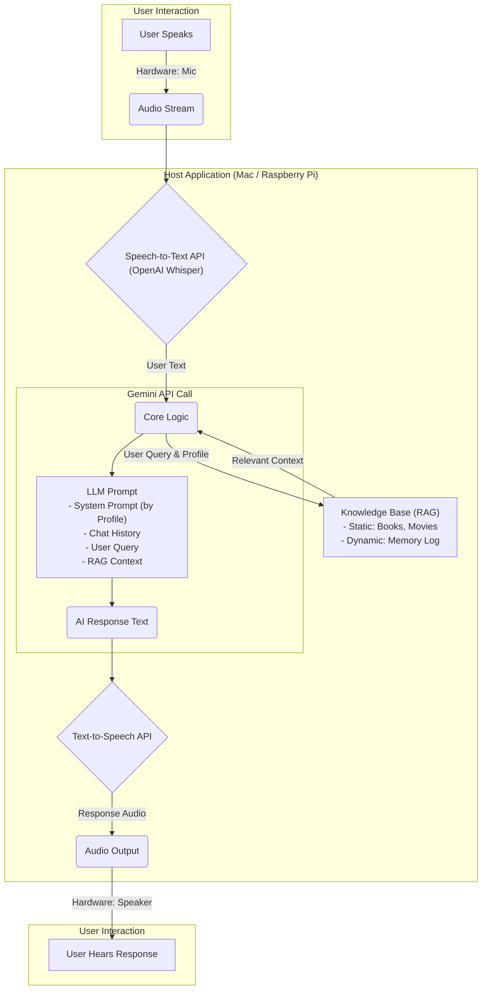

# vox-familia

> *The Voice of the Family. A personalized AI companion for my loved ones.*

[](https://opensource.org/licenses/MIT)

## About The Project

`vox-familia` 是一个充满个人情感的AI项目，旨在为我的家庭成员——我的孩子、我的父母，我自己——创建一个无屏幕、纯语音的AI互动伴侣。

传统的智能助手功能强大，但缺乏个性与记忆。本项目的核心是构建一个**多用户画像（Multi-Profile）系统**，让AI能够以不同的身份、性格和知识储备与特定家庭成员交流。它不仅能回答问题，更能“记住”每个人的喜好，了解我儿子最爱的绘本，熟悉我父母感兴趣的话题，成为一个真正懂我们的家庭成员。

## Core Features

  * **👥 多用户画像系统 (Multi-Profile System)**: 可轻松切换用户身份（如`son`, `parent`, `default`），每个身份拥有独立的性格、知识库和记忆。
  * **🧠 个性化知识库 (Personalized Knowledge Base)**: 基于**检索增强生成 (RAG)** 技术，AI能够深入理解并回答关于特定绘本、动画或家庭事件的提问。
  * **🗣️ 动态长期记忆 (Dynamic Long-Term Memory)**: AI能从对话中学习和提取关键信息（如“我今天最喜欢的故事是小熊的冒险”），并将其存入长期记忆，让未来的对话更具情境感知能力。
  * **🎙️ 纯语音交互 (Voice-First Interface)**: 支持“按键通话 (Push-to-Talk)”或“唤醒词”模式，实现自然、无屏幕的交流体验。
  * **☁️ API驱动**: 核心AI能力由强大的大语言模型（如 Google Gemini）和语音模型（如 OpenAI Whisper）驱动。
  * \*\* portability 灵活的硬件部署\*\*: 项目设计支持多种硬件方案，从简单的Mac + 蓝牙耳机，到独立的树莓派，再到定制的ESP32无线终端。

## Architecture

项目采用模块化设计，将语音I/O与AI核心逻辑分离。



## Technology Stack

  * **Language**: Python 3.9+
  * **LLM**: Google Gemini API
  * **Speech-to-Text**: OpenAI Whisper API
  * **Text-to-Speech**: OpenAI TTS API (or other provider)
  * **Vector Database (for RAG)**: ChromaDB (local) or Pinecone (cloud)
  * **Hardware Prototypes**:
      * macOS + Bluetooth Headset
      * Raspberry Pi 4B + USB Mic/Speaker
      * ESP32 (as a wireless audio satellite)

## Getting Started

要启动并运行此项目，请按以下步骤操作。

### Prerequisites

  * Python 3.9 or higher
  * Google AI API Key
  * OpenAI API Key

### Installation

1.  **克隆仓库**
    ```sh
    git clone https://github.com/your_username/vox-familia.git
    cd vox-familia
    ```
2.  **创建并激活虚拟环境**
    ```sh
    python3 -m venv venv
    source venv/bin/activate
    ```
3.  **安装依赖**
    ```sh
    pip install -r requirements.txt
    ```
4.  **配置环境变量**
      * 将 `.env.example` 文件复制为 `.env`
      * 在 `.env` 文件中填入您的API密钥。
    <!-- end list -->
    ```.env
    GOOGLE_API_KEY="YOUR_GOOGLE_API_KEY"
    OPENAI_API_KEY="YOUR_OPENAI_API_KEY"
    ```

### Running the Application

```sh
python main.py --profile son
```

## Roadmap

  * [x] **Phase 1 - MVP**: 在macOS上使用蓝牙耳机作为I/O设备，实现核心对话逻辑。
  * [ ] **Phase 2 - Dedicated Device**: 将应用迁移到带有UPS HAT的树莓派上，实现稳定可靠的独立运行。
  * [ ] **Phase 3 - Custom Hardware**: 开发基于ESP32的无线音频终端，打造终极的定制硬件形态。
  * [ ] **Future - Local Models**: 探索使用本地化的STT/TTS模型，以增强隐私并实现离线功能。

## License

This project is licensed under the MIT License. See the `LICENSE` file for details.

## Acknowledgments

  * A big thank you to the teams behind Google Gemini and OpenAI.
  * To my family, for being the inspiration for this project.
